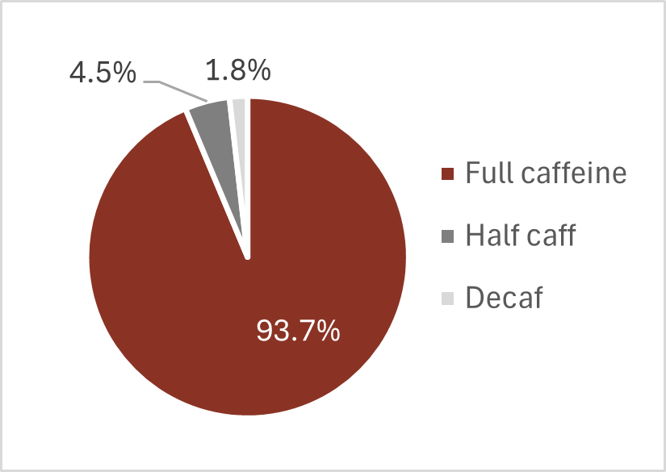
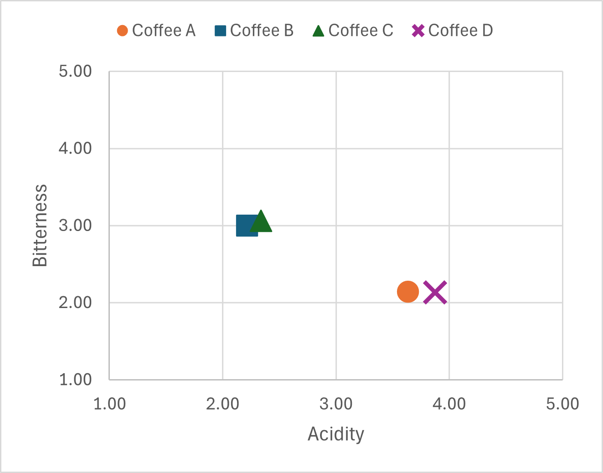
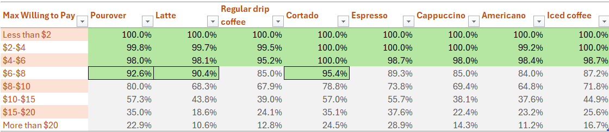

# Coffee-Shop-Business-Strategy---Analysis-of-The-Great-American-Coffee-Taste-Test
 
 #[Report](images/Report.png)

 # Project Overview

The project utilizes real-world survey data to identify the target audience, product offering, and pricing strategy, presenting a data-driven strategy for opening a coffee shop in the United States. This project uses Power Query and Power Pivot in Excel to transform and analyze different question types used in surveys.

Dataset Source: [Great American Coffee Taste Test on Maven Analytics](https://mavenanalytics.io/data-playground)  

Tools Used: #Excel #PowerQuery #PowerPivot  

Data Analysis Skills: #ETL #DataTransformation #DataModeling #ExploratoryDataAnalysis #SurveyData #DataVisualization #TextAnalysis

Source Files:
- [Link to Excel Report](./Coffee_Survey_Analysis.xlsx)

# Table of Contents

- [Project Background](#project-background)
- [Objectives](#objectives)
- [Extract, Transform, and Load (ETL)](#extract-transform-and-load-etl)
- [Data Modeling](#data-modeling)
- [Identifying The Target Audience](#identifying-the-target-audience)
- [Product Offering](#product-offering)
- [Pricing Strategy](#pricing-strategy)
- [Summary](#summary-of-key-insights-and-recommendations)
- [Final Report](#final-report)
- [Appendix](#appendix)

# Project Background

The project assumes the role of an analytics consultant for a group of investors interested in breaking into the U.S. coffee market. The main goal is to analyze published data from "The Great American Coffee Taste Test" by coffee expert and YouTuber James Hoffman

The taste test was conducted on October 22, 2023 in a [YouTube livestream](https://www.youtube.com/watch?v=U489K2t_Tgc&t=281s) where participants perform the coffee taste test as instructed by James Hoffman using frozen coffee concentrate provided by Commuter, a company selling pre-brewed frozen coffee concentrates.

# Objectives

The main objective of the project is to create a business strategy report covering the following areas:
- **Target audience**: What type of customer should we target, and what are their preferences?
- **Product offering**: What types of coffee beans and drinks should we offer?
- **Pricing strategy**: How can we align prices with customer value perception?

# Extract, Transform, and Load (ETL)

Two CSV files from the dataset `GACTT_RESULTS_ANONYMIZED_v2.csv` and `QUESTION_KEY.csv` were imported into Power Query and the two tables were renamed `Responses` and `Question-Key`, respectively.

An index column was created for the Responses table to solve the case sensitivity issues in different tools when using Submission ID as the primary key. The table is then referenced and unpivoted columns so for each index, all the questions are in one column with their respective answers are in another column.

The reference table was duplicated twice, and the reference tables were renamed as follows:
- `Multi` - for multiple select questions. This is essential for analyzing questions with multiple values.
- `Taste-Test-Scale` - for number scale type questions related to the taste test.
- `Coffee-Spend` - for questions related to how much the participants have paid and are willing to pay for a cup of coffee.

For `Taste-Test-Scale`, the table was filtered to only include acidity, bitterness, and personal preference columns for Coffee A, B, C, and D. The question column contains text in the format "Coffee x - Attribute", so was then split into two columns by the delimiter "-" to separate the coffee sample from the attribute. The two columns were trimmed and renamed to "Coffee" and "Attribute".

The `Coffee-Spend` table was filtered to only include the questions "What is the most you've ever paid for a cup of coffee?" and "|What is the most you'd ever be willing to pay for a cup of coffee?".

Transforming Multi involves the following steps:
1. Merged with Question-Key table through a left outer join for easier filtering of data.
2. Filter rows to only include _null_ question type, for the Boolean-encoded values of the multiple-select values do not have a question type label. Submission ID was also excluded in the questions included. The Question Type column was then removed.
3. Change Type of the value column to Whole Number to allow numerical calculations during analysis.
4. Split by Delimiter - the questions column is in the format "Question (choice)", so splitting by the first "(" character split the column into question and choice columns.
5. Extract text before delimiter - Extracting text before ")" at the end of the input removes the extra ")" character.
6. Trim - removes whitespaces from the question and choice columns.
7. The columns were then renamed to "Question" and "Choice".

Below is a screenshot of what the transformed Multi table looks like.


The transformed tables were then loaded into Excel.

# Data Modeling

To enable cross-filtering from the Responses table to the unpivoted tables, the Responses, Multi, Taste-Test-Scale, and Coffee-Spend tables were all added to the data model in Power Pivot. Relationships between the index column of the Responses and the other tables were established through the diagram view in Power Pivot.

# Identifying The Target Audience

It is important to point out the limitations of the survey as it does not represent the entire population of the United States. The participants of the survey voluntarily joined and were likely viewers of James Hoffman's YouTube channel, so these participants are most likely interested in coffee. This may seem like a limitation, but this is the population we are interested in.

Since the main purpose of this analysis is to provide insights on business strategies for opening a coffee shop, the target audience will be consumers who are likely to purchase from a coffee shop. A coffee shop, or a cafe, is a place where customers can purchase beverages, primarily coffee, and food items like cakes and pastries (think of Starbucks or Dunkin'). Participants who drink at least one cup of coffee per day are good candidates for the target audience as they are more likely to make more puchases at a coffee shop than occasional drinkers.

We are interested in three places where daily drinkers enjoy coffee (see chaart below): at the office (33.3%), at a cafe (24.9%), and on the go (16.3%).


We can then classify these target audience into two categories:
1. Cafe Drinkers - These are daily drinkers who selected "at a cafe" as one of the places they typically drink coffee. This is the obvious target audience for a coffee shop.
2. To-Go Drinkers - These are daily drinkers who selected "on the go" or “at the office" but did not select "at the cafe" among the places they drink coffee. This group are likely to purchase coffee as take-out or through a delivery service (e.g., Uber Eats, DoorDash).

These two segments comprise 51.2% of all participants. With 24.9% cafe drinkers and 26.3% to-go drinkers (see chart below). These segments are specific but large enough to gather insights on consumers likely to purchase the coffee shop's products.


The top two reasons for drinking coffee among the target audience iare the taste and the caffeine as shown in the chart below. This helps guide the analysis for product offering by focusing on the flavor preferences of the target audience as well as the choice for cachinnated or decaf coffee.


The distribution of the reported expertise levels among the two groups are similar (shown in the chart below), with averages of 6.19 for Cafe drinkers and 5.75 for To-Go drinkers; moreover, 78.93% of the target audience reported to know the origin of the coffee they consume. These two statistics suggest a target audience of coffee enthusiasts who are fairly knowledgeable about coffee. These types of coffee drinkers likely know and care about the origin and roast level of the coffee beans, and the brewing methods used in the coffee they consume.


# Product Offering

## Favorite Drink

The column and line chart below shows the share of the reported favorite drink among the target audience sorted in descending percentage share. The cumulative percentage represented by the line shows that 90.9% of the target audience reported the following as their favorite drink: **pourover, latte, regular drip coffee, cortado, espresso, cappuccino americano, and iced coffee**. Including these drinks in the coffee shop menu is enough to cover more than 90% of the target audience.


One limitation of the survey is that it does not clearly distinguish between drinkers who prefer hot or cold coffee aside from the ones who selected iced coffee and cold brew. An example that presents ambiguity in the cold/hot preference is a group of people who prefer iced latte, where it is not clear whether iced latte is under iced coffee or latte.

## Coffee Add-Ons

Analysis of what the target audience usually puts in their coffee shows that the majority of the target audience drinks black coffee among the options. 42.5% reported milk or dairy alternative as one of the add-ons they use among the options. Segmenting the target audience into two groups - those who add milk and those who don't, will help enrich the analysis as differences in coffee preferences between the two segments may help guide the curation of product offering.


Only 11.2% of the target audience selected sweeteners among the choices. Unlike dairy, which is an essential ingredient in some coffee drinks, sweeteners can be optional add-ons to the drinks.

Finally, inspecting the dataset shows that the data for specific choices of flavorings is missing, so no useful insights and recommendations can be made for this add-on.

### Dairy Preferences

Only the top dairy options selected by at least 10% of dairy drinkers will be added to the menu. **Whole milk, oat milk, and half and half** are the top three choices as shown in the chart below. Flavored creamer has more than 10% but there is no additional data to identify which flavors were preferred, so the next highest, **almond milk**, will be added to the recommended product offering instead.


### Sweetener Preferences

**Granulated sugar and raw sugar** are sweetener choices selected by over 20% of sweetener users. While **artificial sweeteners** only had 19.9%, it can also be included as add-ons as it enables customers with health concerns (e.g., diabetes) access to the coffee shop's products.


## Favorite Drink - Milk vs. Non-Milk Drinkers

As mentioned earlier, the target audience can be segmented into **milk drinkers (42.5%)** labeled as **"Adds milk"**, and **non-milk drinkers (47.5%)** labeled as **"No Milk"**. A quick Google search will easily tell which drinks have milk or not, an analysis of the preference proportion of the two segments for each drink should uncover any unexpected trends.


As expected, milk-based drinks like latte and cappuccino are preferred by milk drinkers while drinks that are normally just black like pourover, drip coffee, espresso and Americano are preferred by non-milk drinkers. Take note that some milk drinkers selected the non-milk-based drinks as their favorites. This presents ambiguity as to whether these participants add milk to these drinks or not, but this is outside the scope of the analysis for simplicity.

Iced coffee is preferred by more milk drinkers, suggesting iced coffee is more likely to be a milk-based drink.

Lastly and surprisingly, cortado, which is a drink made with equal parts of espresso and milk, is roughly equally preferred by both segments.

## Coffee Strength

Coffee strength can be defined to be proportional to the amount of coffee used when brewing a unit volume of the beverage often referred to as "coffee ratio". Common units of measurement for coffee ratio are grams of coffee per liter of water (or grams per liter) and grams of coffee to milliliters of water ratio (often written as 1:18 for 1 gram of coffee per 18 mL ratio).

While there is no standard ratio for coffee strength, there are common ratios used in the industry. For example, Methodical Coffee, a cafe and retailer of coffee beans in South Carolina, United States, refers [in their website](https://methodicalcoffee.com/blogs/coffee-culture/coffee-to-water-ratio-the-ultimate-guide-to-brewing-ratios#:~:text=Though%20ratios%20are%20completely%20subjective,cup%2C%20use%201%3A18.) to 1:18 as the Coffee golden ratio. On the other hand, James Hoffman recommended in a [YouTube video](https://www.youtube.com/watch?v=ipB6P1uzNYM) a ratio of 60 grams per liter (1:16.7) as a reference point that can be adjusted to preference.

The preference distribution for coffee strength is similar between milk and non-milk drinkers as shown in the chart below. The majority of the target audience prefers medium or somewhat strong. Assuming the earlier mentioned 1:18 as a standard ratio for medium and James Hoffman's 1:16.7 ratio as somewhat strong, **the recommended strength for the product offering is between 1:18 (medium) to 1:16.7 (somewhat strong).**


## Roast Level

The majority of the target audience prefers light or medium roast. More non-milk drinkers prefer light roast while more milk drinkers prefer medium roast. Dark roast is a distant third with a combined total of 9.5% of the target audience. Other roast types like Nordic, Italian, etc. are grouped into others" with only a small share. It is recommended to have **at least one coffee bean option for each roast level**.


Analysis of the top 5 selected flavor notes for each roast level provides details to help the coffee shop in selecting the best coffee beans to sell. Participants who prefer light roast describe their preferred coffee as fruity, bright, juicy, floral, and sweet as the top descriptors.


For medium roast, the top 5 flavor notes are chocolatey, full-bodied, nutty, caramelized, and fruity. Having fruity as one of the top 5 suggests that some participants prefer a roast that is on the lighter side of medium.


Finally, chocolatey, full-bodied, bold, nutty, and caramelized are the top 5 flavor notes for dark roast.


The flavor profiles for medium and dark seem similar, which is expected since there are no strict rules or standards on how coffee beans should be roasted for each roast level. Classifying roast levels is subjective in a way where coffee beans roasted between medium, and dark can be classified either way depending on the individual. Despite the ambiguity, the relative ranks of the flavor notes between medium and dark will help guide in sourcing two distinct beans for the respective roast levels.

## Caffeine Level

93.7% of the target audience prefers normal (fully caffeinated) coffee in agreement with earlier findings where majority of the target audience selected needing the caffeine as one of the reasons for drinking coffee. Therefore, it is recommended to **only have caffeinated coffee beans** for the product offering.



## Taste Test Results

Four coffee samples were used for the taste test, with some details revealed after the survey:
- Coffee A: light roast, washed process.
- Coffee B: medium roast
- Coffee C: Dark roast
- Coffee D: Light roast, natural process (fermented, funky/fruity)

The participants performed the test by melting the coffee pods containing frozen, concentrated coffee into separate containers with boiling water. The taste test was performed, and the samples were scored on a scale of 1 (lowest) to 5 (highest) in terms of acidity, bitterness, and personal preference.

A scatter plot shown below provides a flavor profile of the four coffee samples in terms of the average acidity and bitterness level reported by the participants. Coffee A and Coffee D have similar profiles, tending towards higher acidity and low bitterness. Coffee B and Coffee C have similar profiles with low acidity and medium bitterness.



Comparing the distribution of personal preference scores between the coffee samples and milk or non-milk drinkers shows some interesting patterns. Coffee B and Coffee C show a normal distribution for both types of drinkers. Coffee A has left skewed distribution for both milk and non-milk drinkers. Finally, Coffee D shows different trends for the two segments. The distribution for non-milk drinkers is highly left-skewed, suggesting they really like Coffee D. On the other hand, the distribution for milk drinkers resembles "V" shape, suggesting participants were split into those who really liked the coffee and those who strongly disliked it.


The results for coffees A and D agree with the survey results where non-milk drinkers tend to prefer light roast coffee. Coffee D was also voted as the most preferred coffee out of the four samples for both milk and non-milk drinkers as shown in the chart below.


The high preference scores of Coffee D are worth investigating as it is a viable candidate for a unique product that may help the coffee shop stand out from the rest of the market.

# Pricing Strategy

The line chart shown below has two lines - the light orange dotted line representing the highest amount the participants has paid for a cup of coffee, and the brown line representing the maximum amount participants are willing to pay. The brown line has a higher distribution towards the more expensive end of the range, suggesting the target audience are generally willing to spend more on coffee. This gives us confidence in using the survey data as a basis for formulating a pricing strategy.


The table below shows the percentage of the target audience willing to pay up to the specified amount categorized by drink. This allows us to quickly determine the maximum amount at least 90% of the target audience is willing to pay to guide product pricing.



As indicated by the green background, at least 90% are willing to pay $4 - $6 for the majority of the drinks. Exceptions enclosed in boxes are pourover, latte, and cortado. Latte and cortado are espresso-based beverages and are made with similar methods as other espresso-based drinks in the menu - espresso, Americano, and cappuccino. Therefore, it does not make sense to set higher prices for these drinks.

An alternative pricing strategy is to identify coffee preference trends specific to each of these three drinks that may help in curating premium products that consumers are willing to pay extra. Analyzing taste test results of target audience who prefers pourover, latte, and cortado show that a combined total of 41.1% of the group selected the fermented coffee (Coffee D) as their most preferred coffee overall. Coffee D has the highest share of preference among pourover and cortado drinkers while it is only third among latte drinkers.


While Coffee D is not the most preferred among latte drinkers, it was still selected by 24% of latte drinkers (7.5% overall). Plotting the total percentage of participants willing to pay a maximum amount at each price range for the four coffee samples will provide insights regarding the relationship between the maximum amount willing to pay and coffee preference. The solid brown line representing Coffee D reveals that the decrease in the percentage of participants willing to pay with increasing price is the least steep for Coffee D among the four coffee samples. This suggests that participants who prefer Coffee D are willing to pay more for their coffee. This indirectly implies a higher perceived value of Coffee D.


The last step is to create a flavor profile for Coffee D from the Coffee D - Notes column filtered to include only entries from participants who selected Coffee D as their overall preferred coffee. The following transformations were made.
- Create a table containing Stopwords - common words (e.g. a, an, and, the, or) that will be excluded in text analysis. A list of Stopwords was generated using Microsoft Copilot and was loaded into Power Query (see M code in the Appendix section).
- Create a table Coffee-D-Notes that contains counts of words in the Coffee D - Notes column.
	- Create a reference table of Responses.
	- Filter rows and columns to only include Coffee D notes from entries who prefer Coffee D.
	- Words were capitalized and symbols were removed from the text strings.
	- Strings were split into rows using whitespace as delimiter. Resulting strings were split again into rows by transition from lower to upper case.
	- Strings were aggregated by distinct words and counts of each word was calculated.
	- Table was merged with the Stopwords table by a left anti join to remove stopwords from the aggregated table.

Refer to the Appendix section for the full M code of the transformation. The resulting table looks like this.


The top 10 most frequent words to describe Coffee D was extracted. Since many of the words mean the same (or similar) thing (like fruity and fruit), Five words were hand-picked to describe the flavor profile of Coffee D as highlighted in the chart below: **Fruity, Berries, Sweet, Bright, and Fermented.


# Summary of Key Insights and Recommendations

## Target Audience
- Daily Cafe and To-Go Drinkers are most likely to purchase coffee from coffee sjops.
- The target audience are likely enthusiasts and are knowldgeable about the coffee they purchase.
- Coffee beans to be sold should at least include the following information: origin, roast level, and flavor profile.

## Product Offering

Drinks Menu
- Pourover
- Latte
- Drip Coffee
- Cortado
- Espresso
- Cappuccino
- Americano
- Iced Coffee

Dairy Add-Ons
- Whole milk
- Oat milk
- Half and half

Sweetener Add-Ons:
- Granulated sugar
- Raw sugar
- Artificial Sweetener (e.g., Splenda)

Caffeine level: only caffeinated  
Strength: between 1:18 to 1:16.7 coffee ratio

Coffee Beans:
- **Light Roast** - fruity, bright, juicy, floral, sweet
- **Medium Roast** - chocolatey, full-bodied, nutty, caramelized, fruity
- **Dark Roast** - chocolatey, full-bodied, bold, nutty, caramelized.
- **Premium Fermented Light Roast** - fruity, berries, sweet, bright, fermented.

## Pricing Strategy

Same price range for all drinks.  
Price depends on coffee beans:
- Light, Medium, and Dark Roast - $4 - $6
- Premium Fermented Light Roast - $6 - $8

# Final Report

The findings, insights, and recommendations were compiled into a one-page report as shown below.


# Appendix

## M Code for Stopwords

```M
let
    StopWords = {"A", "About", "Above", "After", "Again", "Against", "All", "Am", "An", "And", "Any", "Are", "Aren't", "As", "At", "Be", "Because", "Been", "Before", "Being", "Below", "Between", "Both", "But", "By", "Can't", "Cannot", "Could", "Couldn't", "Did", "Didn't", "Do", "Does", "Doesn't", "Doing", "Don't", "Down", "During", "Each", "Few", "For", "From", "Further", "Had", "Hadn't", "Has", "Hasn't", "Have", "Haven't", "Having", "He", "He'd", "He'll", "He's", "Her", "Here", "Here's", "Hers", "Herself", "Him", "Himself", "His", "How", "How's", "I", "I'd", "I'll", "I'm", "I've", "If", "In", "Into", "Is", "Isn't", "It", "It's", "Its", "Itself", "Let's", "Me", "More", "Most", "Mustn't", "My", "Myself", "No", "Nor", "Not", "Of", "Off", "On", "Once", "Only", "Or", "Other", "Ought", "Our", "Ours", "Ourselves", "Out", "Over", "Own", "Same", "Shan't", "She", "She'd", "She'll", "She's", "Should", "Shouldn't", "So", "Some", "Such", "Than", "That", "That's", "The", "Their", "Theirs", "Them", "Themselves", "Then", "There", "There's", "These", "They", "They'd", "They'll", "They're", "They've", "This", "Those", "Through", "To", "Too", "Under", "Until", "Up", "Very", "Was", "Wasn't", "We", "We'd", "We'll", "We're", "We've", "Were", "Weren't", "What", "What's", "When", "When's", "Where", "Where's", "Which", "While", "Who", "Who's", "Whom", "Why", "Why's", "With", "Won't", "Would", "Wouldn't", "You", "You'd", "You'll", "You're", "You've", "Your", "Yours", "Yourself", "Yourselves"},
    #"Converted to Table" = Table.FromList(StopWords, Splitter.SplitByNothing(), null, null, ExtraValues.Error),
    #"Renamed Columns" = Table.RenameColumns(#"Converted to Table",{{"Column1", "words"}})
in
    #"Renamed Columns"
```

## M Code for Preparing Text Data For Analysis

```M
let
    Source = Responses,
    #"Filtered Rows1" = Table.SelectRows(Source, each ([#"Lastly, what was your favorite overall coffee?"] = "Coffee D")),
    #"Removed Other Columns" = Table.SelectColumns(#"Filtered Rows1",{"Coffee D - Notes"}),
    #"Capitalized Each Word" = Table.TransformColumns(#"Removed Other Columns",{{"Coffee D - Notes", Text.Proper, type text}}),
    #"Added Custom" = Table.AddColumn(#"Capitalized Each Word", "Coffee D - Notes Clean", each Text.Select(
    [#"Coffee D - Notes"], 
    {"a".."z","A".."Z","0".."9"," "}
)),
    #"Split Column by Delimiter" = Table.ExpandListColumn(Table.TransformColumns(#"Added Custom", {{"Coffee D - Notes Clean", Splitter.SplitTextByDelimiter(" ", QuoteStyle.Csv), let itemType = (type nullable text) meta [Serialized.Text = true] in type {itemType}}}), "Coffee D - Notes Clean"),
    #"Changed Type" = Table.TransformColumnTypes(#"Split Column by Delimiter",{{"Coffee D - Notes Clean", type text}}),
    #"Split Column by Character Transition" = Table.ExpandListColumn(Table.TransformColumns(#"Changed Type", {{"Coffee D - Notes Clean", Splitter.SplitTextByCharacterTransition({"a".."z"}, {"A".."Z"}), let itemType = (type nullable text) meta [Serialized.Text = true] in type {itemType}}}), "Coffee D - Notes Clean"),
    #"Removed Columns" = Table.RemoveColumns(#"Split Column by Character Transition",{"Coffee D - Notes"}),
    #"Filtered Rows" = Table.SelectRows(#"Removed Columns", each [#"Coffee D - Notes Clean"] <> null and [#"Coffee D - Notes Clean"] <> ""),
    #"Grouped Rows" = Table.Group(#"Filtered Rows", {"Coffee D - Notes Clean"}, {{"Count", each Table.RowCount(_), Int64.Type}}),
    #"Sorted Rows" = Table.Sort(#"Grouped Rows",{{"Count", Order.Descending}}),
    #"Merged Queries" = Table.NestedJoin(#"Sorted Rows", {"Coffee D - Notes Clean"}, Sopwords, {"words"}, "Sopwords", JoinKind.LeftAnti),
    #"Removed Columns1" = Table.RemoveColumns(#"Merged Queries",{"Sopwords"}),
    #"Renamed Columns" = Table.RenameColumns(#"Removed Columns1",{{"Coffee D - Notes Clean", "Notes"}})
in
    #"Renamed Columns"
```

